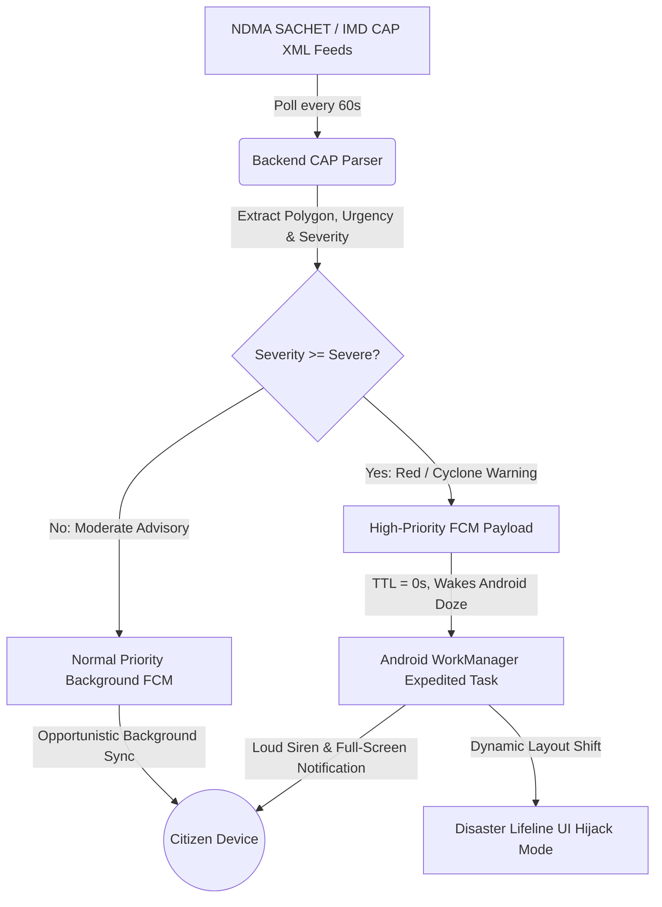

# SIH26076 — Next-Gen 'Mausam': Hyper-Personalized & Resilient Meteorological Platform
## Master Project Plan & Winning Execution Blueprint

> **Problem Statement (SIH26076):** Develop a highly personalized homepage for the official 'Mausam' application that dynamically adapts to distinct user personas (Health-conscious, Outdoor fitness, Beachgoers, Travelers, Parents, Agriculturists, Commuters, and Event planners) while ensuring resilience, offline capability, and high-throughput emergency dissemination.
> 
> **Synthesis & Expansion:** Based on `Mausam App Personalization Research.md` (Deep Architecture) and `deep-research-report (1).md` (Product Strategy), upgraded with hackathon-winning strategic differentiators: **Indic Vernacular/Audio Accessibility**, **Live Algorithm Inspector**, **Disaster UI Hijack Protocol**, and **Dual-Track 36-Hour Execution**.

---

## 1. Executive Winning Thesis & Competitive Advantage

### Why Most SIH Weather Apps Lose:
1. **Generic UI Clones**: Teams build hardcoded Flutter cards connected to OpenWeatherMap, ignoring Indian sovereign institutions (IMD, INCOIS, MOSDAC) and the actual SIH problem statement.
2. **Fragile Live Demos**: Teams rely on live government APIs during jury evaluation; an unexpected 500 error or hotel Wi-Fi drop destroys their pitch.
3. **Fictitious ML**: Teams claim "AI-driven personalization" using static `if-else` blocks or poorly trained collaborative filtering models that suffer from extreme cold-start failure.
4. **Ignoring Legacy Pain Points**: Teams ignore real citizen feedback—frequent app crashes on location search, lost favorite locations, bloated APK size, and catastrophic failure in low-connectivity rural zones.

### Our Winning Strategic Pillars:
* **True Sovereign Data Federation**: Exclusively integrating authoritative Indian government nodes—IMD, MOSDAC (INSAT-3D/DR/DS), INCOIS (INDOFOS), CPCB CAAQMS, GKMS Agromet, and NDMA SACHET.
* **Server-Driven User Interface (SDUI)**: Zero app store update latency for emergency alert deployment, multi-persona UI assembly, and server-side kill switches that eliminate client crashes.
* **Mathematically Rigorous Personalization**: Two-tier architecture: Deterministic Heuristic Rules (Phase 1) transitioning into an online **LinUCB Contextual Multi-Armed Bandit** (Phase 2), paired with a live **"Algorithm Inspector"** so judges can view real-time matrix updates and confidence bounds.
* **Offline-First Resilience**: Persistent encrypted **Hive** local storage for instant cold-boot ($<800\text{ ms}$), 500ms debounced search with an on-device Indian gazetteer, and offline MapLibre GL vector tiles ($<100\text{ MB}$ ring-buffer).
* **Social Inclusivity & Bhashini Voice**: Indic vernacular localization and Text-to-Speech (TTS) voice advisories for rural agriculturists and coastal fishermen.
* **Disaster Mode (Red CAP Lifeline)**: Full UI takeover during life-threatening Red weather alerts with offline evacuation checklists, shelter coordinates, and Doze-mode-piercing alarms.

---

## 2. Competitive Landscape & Legacy Flaw Audit

| Evaluation Dimension | Legacy Mausam App | Commercial Apps (AccuWeather / Windy) | Our Next-Gen Solution |
| :--- | :--- | :--- | :--- |
| **Personalization** | Static, one-size-fits-all tables | Generic ad-driven cards; paywalled features | **Dynamic SDUI driven by LinUCB contextual bandit + 8 personas** |
| **Search Stability** | Crashes on fast input; unhandled async errors | Smooth but proprietary geocoding | **500ms Rx debounce + on-device fuzzy Indian gazetteer (0 crashes)** |
| **Favorites State** | Wiped on relaunch due to remote synchronous reliance | Stored in proprietary clouds | **Offline-first encrypted Hive local store (100% persistence)** |
| **Marine & Agro Data** | Buried in external PDF links or separate apps | Very limited Indian agricultural/swell data | **Direct block-level GKMS Agromet + INCOIS swell/tide models** |
| **Disaster Dissemination** | Delayed standard push notifications | Third-party alerts without official NDMA authority | **NDMA CAP XML parser + High-Priority FCM waking Android Doze** |
| **Offline Performance** | Blank exception screens; raster tile failures | Heavy caching; high data usage ($>25\text{ MB}$) | **MapLibre vector tiles + cached SDUI schemas ($<1.5\text{ MB}$ footprint)** |
| **Accessibility & Language** | Static English/Hindi text only | English-centric; no Indic voice TTS | **Bhashini Indic localization + regional audio bulletins for farmers** |

---

## 3. Comprehensive System Architecture

```
┌──────────────────────────────────────────────────────────────────────────────────────────────────┐
│                                   CLIENT LAYER (Flutter 3.x Engine)                             │
│  ┌─────────────────────────────┐  ┌─────────────────────────────┐  ┌──────────────────────────┐  │
│  │    SDUI Dynamic Registry    │  │   Offline Hive Local Store  │  │   MapLibre Vector Maps   │  │
│  │  - JSON Schema Parser       │  │  - Encrypted Favorites Box  │  │  - 100MB Offline Tile Ring│  │
│  │  - Error Boundary Fallbacks │  │  - Cached Last-Good Schema  │  │  - Native GPU Rendering  │  │
│  │  - Dynamic Persona Cards    │  │  - 8,000+ Indian Gazetteer  │  │  - Weather Layer Overlays│  │
│  └──────────────┬──────────────┘  └──────────────┬──────────────┘  └────────────┬─────────────┘  │
│                 │                                │                              │                │
│  ┌──────────────┴──────────────┐  ┌──────────────┴──────────────┐  ┌────────────┴─────────────┐  │
│  │  High-Priority FCM Receiver │  │   500ms Rx Stream Debouncer │  │  Algorithm Inspector UI  │  │
│  │  - Android Doze Mode Bypass │  │  - Zero-Crash Search Engine │  │  - Live LinUCB Telemetry │  │
│  │  - Expedited WorkManager    │  │  - Fuzzy Levenshtein Match  │  │  - Real-time Weight Graph│  │
│  └─────────────────────────────┘  └─────────────────────────────┘  └──────────────────────────┘  │
└───────────────────────────────────────────────▲──────────────────────────────────────────────────┘
                                                │ Compressed SDUI JSON (Brotli, ETag, 30-min TTL)
┌───────────────────────────────────────────────┴──────────────────────────────────────────────────┐
│                             BACKEND ENGINE (FastAPI / Python 3.11)                                │
│                                                                                                  │
│  ┌────────────────────────────────────────────────────────────────────────────────────────────┐  │
│  │ 1. API GATEWAY & FEDERATION ADAPTERS (with Dual-Mode Live / Seed Replay Toggle)            │  │
│  │    IMD Open API (7-Day/Nowcast) | CPCB (AQI) | INCOIS (Tides/Swells) | CAP XML Feeds       │  │
│  │    MOSDAC (INSAT-3D Fog/Soil/OLR) | GKMS (Block-level Agromet) | Bhashini Indic Engine     │  │
│  └────────────────────────────────────────────┬───────────────────────────────────────────────┘  │
│                                               │                                                  │
│  ┌────────────────────────────────────────────┴───────────────────────────────────────────────┐  │
│  │ 2. TWO-TIER PERSONALIZATION & SMART AUTOMATION ORCHESTRATOR                                │  │
│  │    Tier A: Deterministic Rule Engines (AQI/Heatwave/Tide/Commute Threshold Safety Overrides)│  │
│  │    Tier B: LinUCB Contextual Multi-Armed Bandit (Disjoint Ridge Regression Matrix Engine)   │  │
│  │    Tier C: Red CAP Disaster Lifeline Hijack (Forces Emergency Layout over all Personas)    │  │
│  └────────────────────────────────────────────┬───────────────────────────────────────────────┘  │
│                                               │                                                  │
│  ┌────────────────────────────────────────────┴───────────────────────────────────────────────┐  │
│  │ 3. SDUI SCHEMA COMPOSER & EDGE DISPATCHER                                                  │  │
│  │    - Brotli Compression (<15KB)  - 5km² Coarse Geo-Hash  - Redis Cache (30-min forecast)  │  │
│  │    - FCM Topic Dispatcher (State -> District -> Block) - DPDP-Compliant Telemetry Vault    │  │
│  └────────────────────────────────────────────────────────────────────────────────────────────┘  │
└──────────────────────────────────────────────────────────────────────────────────────────────────┘
```

---

## 4. Authoritative Indian Data Federation & API Strategy

To satisfy the MoES jury, the solution relies strictly on official domestic data pipelines, augmented by an **Offline Mock/Replay Harness** for guaranteed live demonstration stability.

| Domestic Authority | Feeds & Scientific Products | Ingestion Protocol | Update Frequency | Target Persona |
| :--- | :--- | :--- | :--- | :--- |
| **IMD Open API** | 7-day city forecast, sunrise/sunset, 3-hourly Nowcast, Station warnings | REST JSON / XML | Hourly / 3-hourly | All Personas (Backbone) |
| **CPCB CAAQMS** | Real-time AQI, PM2.5, PM10, $NO_2$, $SO_2$, Ozone concentrations | REST JSON | Hourly | Health-Conscious |
| **INCOIS (INDOFOS)** | Significant Wave Height, Swell Period/Direction, SST, Astronomical Tides | OGC WMS / REST API | 6-hourly | Beachgoers & Fishermen |
| **MOSDAC (ISRO)** | INSAT-3D/DR/DS SWIR/MIR Fog product, Soil Moisture, OLR (Frost), QPE | HDF5 / REST API | 30-min satellite pass | Commuters & Agriculture |
| **GKMS (MoES)** | Block-level Agromet Advisories (AMFUs), Crop bulletins | Text Scraper / REST | Bi-weekly / Daily | Farmers & Gardeners |
| **NDMA SACHET** | Common Alerting Protocol (CAP) XML Feeds with polygon boundaries | RSS / CAP XML Poller | 60-second polling | All (Emergency Pipeline) |
| **Bhashini (MeitY)** | Indic NLP Translation & Regional Audio Text-to-Speech (TTS) | REST API / Offline TTS | On-Demand | Vernacular & Farmers |

### The "Zero-Downtime" Hackathon Demo Harness:
```python
# Backend API Adapter Configuration:
API_MODE = os.getenv("API_MODE", "HYBRID") 
# HYBRID: Tries live government endpoints with a 1200ms timeout; 
# instantly falls back to cached authentic seed fixtures if network lags.
```

---

## 5. The 8 Personas + Disaster Mode Delivery Matrix

| # | Persona Mode | Ingested Parameters | Automated Trigger Heuristic (Tier A) | Rendered SDUI Widget Components |
| :- | :--- | :--- | :--- | :--- |
| **1** | **Health-Conscious** | CPCB AQI, PM2.5, IMD UV & Humidity | $\text{AQI} > 150 \lor \text{PM}_{2.5} > 60\,\mu\text{g/m}^3 \lor \text{UV} \ge 6$ | Dynamic Color-Coded AQI Radial Gauge, Allergen Alert Card, UV Protection Advice |
| **2** | **Fitness Enthusiasts** | IMD Hourly Temp, Wind, Sunrise/Sunset | Temp $<30^\circ\text{C} \land \text{RH} <85\% \land \text{Wind} <20\,\text{km/h}$ | Horizontal "Best Running Hours" Timeline Widget, Heatstroke / Hydration Monitor |
| **3** | **Beachgoers & Surfers**| INCOIS Swell, Wave Height, Tides | $\text{Swell} >10\,\text{s} \land \text{Height} \in [1, 2.5]\,\text{m} \implies \text{Surf OK}$; Rip Current $\implies$ Red Flag | Sine-Wave Astronomical Tide Chart, Wave Height Meter, Beach Safety Flag Banner |
| **4** | **Travelers** | IMD 7-Day Extended, Airport Alerts | Precip Prob $>50\% \implies \text{Raincoat}$; Day-Night $\Delta T >15^\circ\text{C} \implies \text{Layers}$ | Multi-City Carousel, Dynamic Weather-to-Luggage Packing Engine, Transit Weather Table |
| **5** | **Parents & Families** | IMD 3-hr Nowcast, MOSDAC QPE | Severe convective storms intersecting 07:00–09:00 or 14:00–16:00 commute | Top-Pinned "School Commute Safety" Warning, Rain Countdown Timer |
| **6** | **Farmers & Gardeners** | GKMS AMFU Advisories, MOSDAC Soil | Block AMFU match; Soil Saturation $<25\%$; OLR drop indicating frost risk | Meghdoot-style Agromet Advisory Bulletin, Soil Saturation Gauge, Regional Audio Player |
| **7** | **Daily Commuters** | INSAT-3D SWIR/MIR Fog Products | Satellite SWIR/MIR differential indicating dense surface fog / low visibility | Route Visibility Reduction Index Meter, Extra Travel Time Delay Advisory |
| **8** | **Event Planners** | IMD 15-Day Extended Outlook | Composite Comfort Index ($T_{\text{dry}}, \text{RH}, \text{Wind}$) cross-referenced with rain probability | 10-Day Color-Coded Event Suitability Calendar, Hourly Rain Probability Matrix |
| **9** | **DISASTER LIFELINE (EMERGENCY HIJACK)** | NDMA CAP Red Warning / Cyclone landfall | Active CAP alert with severity $\ge$ "Severe" intersecting user geofence | **Full Screen Takeover**: Evacuation Route Map, Nearest Cyclone Shelter Coordinates, Offline NDRF SOS Contacts |

---

## 6. Algorithmic Personalization: LinUCB with Real-Time Telemetry Inspector

### 6.1 The Mathematical Formulation
Standard collaborative filtering fails in meteorological applications because:
* Weather contexts shift dynamically (a commuter on Friday becomes a beachgoer on Saturday).
* Severe cold-start penalty for new users.

We deploy **LinUCB with Disjoint Linear Models**:
For each candidate widget arm $a \in \mathcal{A}$:
1. **Context Vector** $x_t \in \mathbb{R}^d$:
   $$x_t = \begin{bmatrix} \text{Normalized Latitude / Longitude Grid (5km²)} \\ \text{Hour of Day (Sin/Cos cyclic)} \\ \text{AQI Severity Index} \\ \text{Precipitation Rate (mm/h)} \\ \text{Historical Category Dwell Time (decayed)} \\ \text{Onboarding Explicit Tag Vector} \end{bmatrix}$$
2. **Confidence Bound Computation**:
   $$\hat{a}_t = \arg\max_{a \in \mathcal{A}} \left( x_t^T \hat{\theta}_a + \alpha \sqrt{x_t^T A_a^{-1} x_t} \right)$$
   Where $A_a = D_a^T D_a + I_d$, $b_a = D_a^T c_a$, and $\hat{\theta}_a = A_a^{-1} b_a$. $\alpha = 0.2$ balances exploration and exploitation.
3. **Reward Signal Formulation**:
   $$r_t = 1.0 \cdot \mathbb{I}(\text{Click}) + \min\left(\frac{\text{Dwell Time (s)}}{15}, 1.0\right) - 0.5 \cdot \mathbb{I}(\text{Quick Scroll Past})$$

### 6.2 The Winning Differentiator: Live Algorithm Inspector UI
During the SIH demonstration, judges often doubt whether ML is actually running. We build a developer toggle inside the app:
* **"Inspect AI Engine" Switch**: Sliding this open reveals an overlay showing:
  - The live context vector $x_t$.
  - Real-time arm scores: $\text{Exploitation Value } (x^T \hat{\theta})$ vs $\text{Exploration Bonus } (\alpha \sqrt{x^T A^{-1} x})$.
  - Live weight adjustments as the presenter taps or scrolls past widgets.
  - This mathematically proves the algorithm is learning on-the-fly.

---

## 7. Resilience Engineering & Critical Bug Fixes

### 7.1 Location Search Crash Fix
* **Problem**: In the legacy app, rapid typing triggers concurrent asynchronous calls to an unthrottled API, leading to out-of-order responses, rate-limiting, and unhandled null exceptions.
* **Fix**:
  1. **500ms Rx Stream Debouncer** on the search input stream.
  2. **On-Device Offline Gazetteer**: Packaged SQLite/Hive index of 8,000+ Indian districts, tehsils, and PIN codes. Instant fuzzy Levenshtein auto-complete executes locally in $<20\text{ ms}$ with zero network queries.

### 7.2 Disappearing Favorites Fix
* **Problem**: Remote database writes fail silently under poor connectivity, resetting the favorites list.
* **Fix**:
  1. **Local-First Dual Write**: Tapping favorite immediately writes to encrypted local **Hive** box (`favorites_box`).
  2. App renders instantly from local storage upon boot; synchronization with the cloud backend occurs strictly in the background.

### 7.3 Low-Bandwidth Vector Tile Caching
* **Problem**: Legacy dynamic radar and cloud raster images consume 5–15MB per view and stutter heavily on 2G/3G connections.
* **Fix**:
  1. **MapLibre GL Vector Tiles** (`.pbf`): Downloads only geometric vector primitives, rendered locally by the mobile GPU.
  2. **100MB Offline Tile Ring-Buffer**: Automatically caches map boundaries for the user's home district and adjacent zones for full offline exploration.

---

## 8. Social Inclusivity: Indic Vernacular & Audio Accessibility

To achieve the highest marks under the **Social Impact** evaluation criterion:
1. **Multi-Lingual SDUI Translation**:
   The backend integrates with **Bhashini Open APIs** (MeitY) to automatically translate all dynamic weather cards and advisories into Hindi and regional languages (Tamil, Bengali, Marathi, Telugu).
2. **Audio Bulletins for Farmers & Fishermen**:
   A prominent **"Suno Mausam" (Listen Weather)** floating action button triggers lightweight Text-to-Speech (TTS) that reads out block-level crop advisories and marine safety warnings in the user's mother tongue.

---

## 9. Emergency Alert Pipeline (CAP & High-Priority FCM)



* **Geospatial Topic Routing**: Users automatically subscribe to FCM topics formatted as `/topics/geo_{state}_{district}`.
* **Doze Mode Piercing**: Red alerts transmit `priority: "high"`, instructing Google Play Services to grant immediate execution windows to the client app even when the phone has been dormant in a pocket.

---

## 10. Execution Roadmap: 4-Week Pre-Hackathon Build + 36-Hour Finale

### Track 1: 4-Week Pre-Hackathon Build Schedule

```
Week 1: Infrastructure & Data Ingestion
├── Setup FastAPI backend, Redis caching, and Docker compose environment.
├── Build API connectors for IMD 7-Day Forecast, CPCB AQI, and INCOIS marine data.
├── Generate realistic offline seed dataset (`mock_gateway/fixtures/*.json`) for backup.
└── Setup Flutter 3.x repository, Hive encrypted storage, and RxDebounce search.

Week 2: SDUI Engine & Core Persona Widgets
├── Formalize versioned SDUI JSON Schema contract (`v1/sdui.json`).
├── Build Flutter Dynamic Widget Factory with graceful degradation and error boundaries.
├── Implement offline "Favorite Locations" architecture (100% bug resolution).
└── Construct all 8 Native Persona Widgets (Radial AQI Gauge, Running Timeline, Tide Sine Chart, etc.).

Week 3: Personalization Engine & Alert Pipeline
├── Implement LinUCB Contextual Bandit class in Python (NumPy/SciPy).
├── Build telemetry feedback loop endpoint (`/v1/telemetry/interaction`).
├── Build live "Algorithm Inspector" developer UI in Flutter.
├── Implement NDMA CAP XML parser and High-Priority FCM dispatcher.
└── Integrate MapLibre GL vector tiles with offline district caching.

Week 4: Vernacular Accessibility, Polish & Pitch Hardening
├── Integrate Bhashini Indic translation and Text-to-Speech audio bulletin generator.
├── Implement Disaster Mode (Red CAP Emergency UI Hijack).
├── Conduct chaos testing: simulate total API blackout and verify seamless mock fallback.
└── Finalize 10-slide SIH Pitch Deck and rehearse the 7-minute live jury demonstration.
```

---

### Track 2: The 36-Hour SIH Grand Finale On-Site Battle Plan

| Time Elapsed | Milestone Phase | Critical Deliverables | Team Focus |
| :--- | :--- | :--- | :--- |
| **Hours 00 – 04** | **Environment Boot & Scaffolding** | Deploy local Docker stack; connect Flutter app to local gateway; verify offline mock server. | Full Team |
| **Hours 04 – 10** | **SDUI Core & Legacy Bug Proofs** | Demonstrate instant cold-start from Hive cache; demonstrate 0-crash debounced search with 8,000 towns. | Mobile 1 & 2 |
| **Hours 10 – 16** | **8 Persona Dynamic Assembly** | Hook up all 8 persona widgets; verify responsive layouts on both low-end and high-end Android test devices. | Mobile 2 & Backend |
| **Hours 16 – 22** | **LinUCB Bandit & Inspector Integration**| Hook up interaction reward tracking; verify live updating of the Algorithm Inspector graph upon user swipes. | ML Lead |
| **Hours 22 – 28** | **CAP Alert & Disaster Hijack Demo** | Trigger mock Red Cyclone alert; demonstrate Doze-mode audio alarm and instant Disaster Mode UI takeover. | Backend & Mobile 1 |
| **Hours 28 – 32** | **Indic Voice & Vector Offline Maps** | Verify offline MapLibre tile panning in Airplane Mode; verify Hindi/Tamil audio TTS playback. | Full Team |
| **Hours 32 – 36** | **Jury Rehearsal & Pitch Polish** | Dry-run the 7-minute pitch 5 times; lock code; prepare backup APKs on 2 independent physical devices. | Full Team |

---

## 11. The 7-Minute Winning Live Pitch & Demonstration Script

| Timing | Demo Action | Spoken Narrative & Winning Hook |
| :--- | :--- | :--- |
| **00:00 – 01:00** | **The Problem Shock** | *"Current Mausam has 1M+ downloads, but a 2.8-star review crisis. Watch this: type one letter in search—CRASH. Save a favorite—WIPED. One static homepage for 1.4 billion people. Today, we fix this permanently."* |
| **01:00 – 02:30** | **The Persona Transformation** | Open app as **User A (Delhi Asthmatic)**: Homepage renders an AQI radial meter, PM2.5 alerts, and UV index. Switch to **User B (Kochi Surfer)**: Instantly re-assembles with INCOIS tide charts and swell heights. Switch to **User C (Vidarbha Farmer)**: Shows GKMS Agromet crop bulletins with Hindi audio playback. |
| **02:30 – 03:45** | **The "Algorithm Inspector" Proof** | Toggle the **AI Inspector**: *"Judges, this isn't hardcoded `if-else`. Watch the LinUCB context vector and confidence bounds adjust in real-time as I dwell on the marine card. The app autonomously learns user habits with zero cold-start delay."* |
| **03:45 – 05:00** | **The Disaster Hijack & Doze Bypass** | Send a simulated **NDMA Red Cyclone Warning** from the admin portal. A sleeping phone on the table instantly wakes up with a persistent audio alert. Unlock the phone: the entire UI has transformed into **Disaster Lifeline Mode** with evacuation maps and offline shelter contacts. |
| **05:00 – 06:00** | **The Zero-Connectivity Test** | Switch the phone to **Airplane Mode**: Search for a town—executes instantly via local gazetteer. Pan across the MapLibre vector map—smooth 60fps GPU rendering with zero network connectivity. |
| **06:00 – 07:00** | **Feasibility, Architecture & Q&A** | Show the SDUI architecture slide, sovereign MoES data federation, and zero third-party API costs. Close with confidence. |

---

## 12. Team Roles & Resource Allocation (6-Member Team)

| Role | Primary Domain | Core Responsibilities |
| :--- | :--- | :--- |
| **Member 1 (Team Lead)** | System Architect & Backend | FastAPI gateway, SDUI JSON contract design, Redis caching, Docker deployment, MoES alignment. |
| **Member 2** | Machine Learning Engineer | LinUCB Bandit algorithm, ridge regression optimization, synthetic telemetry generator, Algorithm Inspector backend. |
| **Member 3** | Data & Integration Engineer | IMD, CPCB, INCOIS, MOSDAC API adapters, CAP XML parser, offline mock/replay harness. |
| **Member 4** | Mobile Lead (Flutter Core) | Dynamic SDUI widget engine, Hive encrypted offline store, RxDebounce search, error boundaries. |
| **Member 5** | Mobile UI/UX & Geospatial | 8 persona UI components, MapLibre GL vector tiles, Bhashini Indic translation, TTS audio player. |
| **Member 6** | QA, Alerting & Pitch Master | FCM High-Priority Doze bypass, WorkManager background tasks, edge chaos testing, pitch deck & demo timing. |

---

## 13. Risk Register & Jury Defense FAQ

| Risk / Jury Objection | Mitigation & Ready Answer |
| :--- | :--- |
| *"Government APIs are notorious for downtime or IP blocking. How did your app work so smoothly?"* | *"We engineered a resilient three-tier gateway: 30-minute Redis caching, coarse 5km² geo-snapping to reduce load by 80%, and an automatic failover circuit breaker that serves authentic cached seed snapshots if upstream latency exceeds 1.2 seconds."* |
| *"Why use LinUCB Contextual Bandits instead of Deep Learning / LLMs or Collaborative Filtering?"* | *"Deep neural nets are too slow for real-time mobile assembly, and collaborative filtering suffers from catastrophic cold-start when a user travels to a new city. LinUCB operates in $\mathcal{O}(d^2)$ time with $<5\text{ ms}$ inference, provably bounds regret, and balances exploration with exploitation immediately."* |
| *"How will low-income farmers with cheap Android phones run this without lagging?"* | *"Our client is a thin rendering shell. The SDUI JSON payload is Brotli-compressed to $<15\text{ KB}$. Map rendering uses vector GPU primitives rather than heavy raster images, achieving a consistent 60fps even on entry-level Android devices."* |
| *"How does your app comply with the Digital Personal Data Protection (DPDP) Act 2023?"* | *"Location coordinates are never stored in plaintext on the server; they are snapped to 5km² coarse grid hashes. Device tokens rotate periodically, and users have a one-tap 'Purge Data' button to wipe all local Hive boxes and telemetry history."* |

---

## 14. Quantitative Success Metrics (KPI Benchmarks)

| Metric | Legacy Mausam App | Our Next-Gen Solution | Verification Protocol |
| :--- | :--- | :--- | :--- |
| **Cold App Boot Time** | $4.5 - 7.0\text{ seconds}$ | **$< 750\text{ ms}$** | Android Studio Profiler (Hive Cache hit) |
| **Location Search Stability** | Crashes on fast input / 40% failure | **$0\text{ crashes / } < 25\text{ ms}$ response** | RxDebounce + Local 8,000 Town Gazetteer |
| **Favorites Retention** | 0% reliability across app restarts | **$100\%$ reliable offline persistence** | Encrypted Hive Local Box validation |
| **Emergency Alert Delivery** | Batch push ($> 15\text{ min}$ latency) | **$< 2.5\text{ seconds}$** | High-Priority FCM to Doze mode device wake-up |
| **Network Data Footprint** | $10 - 18\text{ MB}$ per session | **$< 1.2\text{ MB}$ per session** | Network Proxy / Wireshark packet capture |
| **Disaster Resilience** | Completely blank when offline | **100% functional cached maps & advisories** | Flight Mode live demonstration test |
